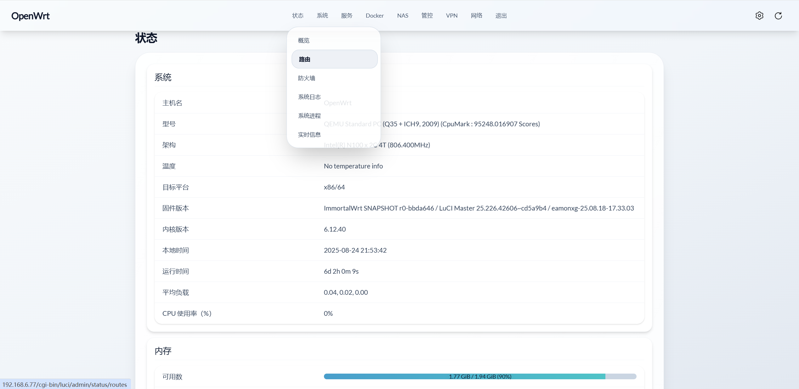
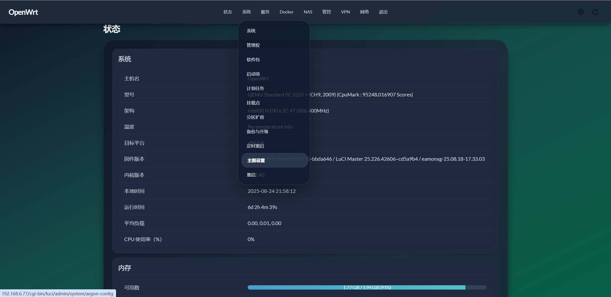
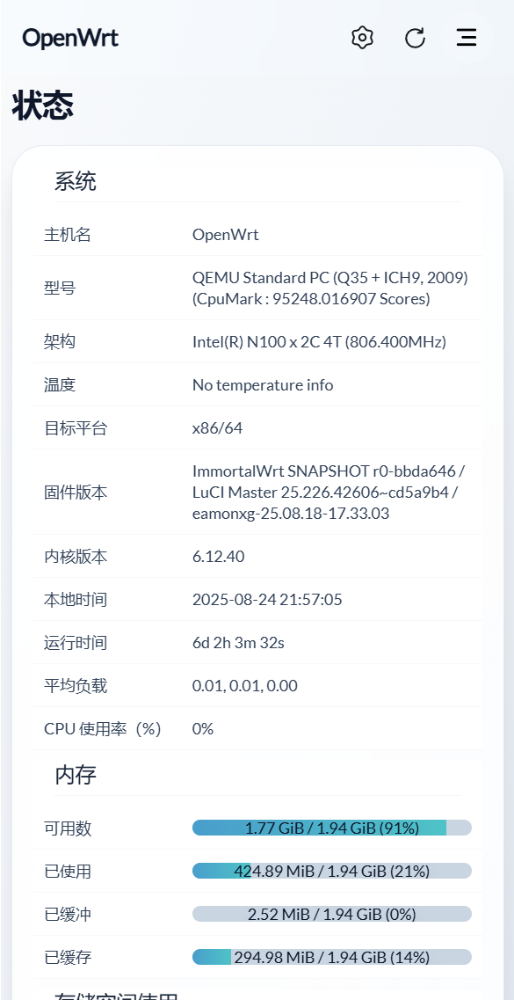

# LuCI Theme Aurora

[English](README_EN.md) | **简体中文**

------

## 简介

**luci-theme-aurora** 是一款专为现代浏览器设计的 OpenWrt 主题。
 主题的灵感源自 **Aurora（极光）** —— 在挪威，白天映入眼帘的是洁白纯净的雪山，夜幕降临则是天际舞动的极光。
 同样在主题中，我希望白天模式呈现雪山般纯净，暗夜模式展现极光般迷人。

## 兼容性

- **OpenWrt**：由于主题使用 ucode 模板，需要 **OpenWrt 22.03** 或更高版本。
- **浏览器**：主题基于 **TailwindCSS v4** 开发，请使用以下现代浏览器：
  - **Chrome 111** *(2023 年 3 月发布)*
  - **Safari 16.4** *(2023 年 3 月发布)*
  - **Firefox 128** *(2024 年 7 月发布)*

## 预览

### 桌面模式

 

### 移动端

## 关于开发

步入 2025 年，市面上的 OpenWrt 主题开发方式仍然较为原始，而前端工具链已非常成熟。这也是我选择使用 **Vite + TailwindCSS** 开发的原因。
 借助 Vite 的强大功能，我能享受到现代前端开发体验，再也不用手动替换路由器上的 CSS 文件来查看修改效果了~

